# 📋 Contract Compiler

## The Hallucination Crisis

Every developer has experienced this:

You ask an AI to integrate Stripe. It confidently generates:

*"Use `stripe.customer.create_subscription()` to create a subscription with `plan_id`..."*

**Problem:** That method doesn't exist. Neither does `plan_id`.

You just wasted 30 minutes debugging an API that was never real.

---

## Why AI Hallucinates

Traditional AI code generators have a fundamental flaw:

### They Rely on Training Data

- **APIs change** — Methods get deprecated, parameters rename
- **Libraries confuse** — `stripe.customers.create()` vs `stripe.subscriptions.create()`  
- **Patterns blend** — REST vs GraphQL vs gRPC conventions mix
- **Documentation ages** — Stack Overflow answers from 2019 feel current

The AI doesn't **know** what exists. It **guesses** based on patterns it saw during training.

**This is AI slop—plausible-sounding, confidently wrong.**

---

## The Contract Authority Solution

Jobel introduces **Contract Authority**: the LLM can **only** reference APIs that are verified in the Contract Registry.

```mermaid
flowchart LR
    Docs[📄 Documentation<br/>OpenAPI, Markdown] --> Compiler[⚙️ Contract Compiler<br/>Extract & Verify]
    Compiler --> Registry[(📋 Contract Registry<br/>Verified APIs)]
    Registry --> LLM[🧠 LLM<br/>Grounded Generation]
    LLM --> Output[✅ Verified Code<br/>Only uses real APIs]
```

**If the AI suggests a method, it's because it exists in your documentation.**

---

## How the Contract Compiler Works

### Step 1: Documentation Ingestion

Upload your API documentation in any format:
- OpenAPI / Swagger specs
- Markdown documentation
- JSON API responses
- Code examples

The Contract Compiler parses all of them.

---

### Step 2: Contract Extraction

The Compiler extracts **verified contracts** with:

- **Method signatures** — Exact function/API names
- **Parameters** — Required vs optional, types, validation rules
- **Authentication** — API keys, OAuth, JWT requirements
- **Response schemas** — Expected return types
- **Security patterns** — Webhook signature verification, idempotency

**Example:**  
From Stripe's OpenAPI spec, the Compiler extracts:

**Contract:**  
`stripe.subscriptions.create()`

**Required Parameters:**  
- `customer` (string) — Customer ID
- `items` (array) — Subscription items with `price` field

**Optional Parameters:**  
- `payment_behavior` (string) — How to handle payment failures
- `metadata` (object) — Custom key-value data

**Authentication:**  
Bearer token in `Authorization` header

---

### Step 3: Registry Storage

Contracts are stored in a structured registry with:

- **Confidence scores** — How reliably was this extracted?
- **Source metadata** — Which documentation file?
- **Versioning** — Track API changes over time

The registry is backed by PostgreSQL for fast lookups.

---

### Step 4: Grounded Generation

When the Executor agent generates code, it **must** reference the Contract Registry:

**Without Contract Authority (AI slop):**  
*"I think Stripe has a `create_subscription` method on the `customer` object..."*

**With Contract Authority (Jobel):**  
*"The Contract Registry shows `stripe.subscriptions.create()` requires `customer` and `items` parameters."*

**Result:** Zero hallucinations.

---

## What This Prevents

### Hallucinated Methods
**Generic AI:** Invents `stripe.customer.add_plan()`  
**Jobel:** Uses verified `stripe.subscriptions.create()`

### Wrong Parameters
**Generic AI:** Passes `plan_id` (deprecated in Stripe API v2020+)  
**Jobel:** Uses verified `items[].price` structure

### Missing Authentication
**Generic AI:** Forgets to mention API key requirements  
**Jobel:** Contract includes auth requirements—automatically enforced

### Security Gaps
**Generic AI:** Generates webhook handler without signature verification  
**Jobel:** Contract specifies `stripe.webhooks.constructEvent()` for verification

---

## Beyond Zero Hallucinations

The Contract Compiler doesn't just prevent hallucinations—it enables:

### 1. Self-Healing Validation

The Critic agent validates generated code against contracts. If a method doesn't exist in the registry, the code is **automatically rejected and regenerated**.

You never see the mistake.

### 2. Internal API Support

Upload your **internal** API documentation. Jobel generates code for proprietary systems with the same reliability as public APIs.

No more "our API isn't in ChatGPT's training data" excuses.

### 3. Version Control

API contracts are versioned. When Stripe releases a breaking change, update your documentation and re-run the Compiler. Jobel instantly adapts.

### 4. Confidence Scoring

Low-confidence contracts are flagged. If the documentation is ambiguous, Jobel requests clarification instead of guessing.

---

## Jobel vs Generic AI

| Issue | ChatGPT / Copilot | Jobel |
|-------|-------------------|-------|
| **Hallucinated methods** | ❌ Common | ✅ Impossible |
| **Outdated APIs** | ⚠️ Training data = 2021 | ✅ Your current docs |
| **Internal APIs** | ❌ No knowledge | ✅ Upload and use |
| **Security gaps** | ⚠️ Manual review required | ✅ Enforced via contracts |
| **API version changes** | ❌ Re-train model | ✅ Re-upload docs |

**The difference: Trust.**

---

## Why This is Manus-Grade

Generic AI tools treat hallucinations as an acceptable bug. "Just review the code," they say.

**That's not good enough for production.**

Jobel treats hallucinations as a **solved problem**. The Contract Compiler ensures that every API method, every parameter, every authentication requirement is **verified before generation**.

This is the reliability you expect from tools built by professionals, for professionals who ship.

---

## Real-World Impact

### Startup Scenario
You're integrating Stripe for your SaaS. With ChatGPT, you spend 2 hours debugging hallucinated methods. With Jobel, you get working code in 10 minutes.

**Time saved:** 1 hour 50 minutes per integration.

### Enterprise Scenario
Your team needs to integrate an internal billing API. Generic AI has no training data for your API. Jobel ingests your OpenAPI spec and generates validated code.

**Outcome:** Internal APIs are as easy as public ones.

### Solo Developer Scenario
It's 2 AM. You're integrating webhooks. Generic AI forgets signature verification. Your endpoint gets exploited.

With Jobel, the contract enforces `stripe.webhooks.constructEvent()`. Your endpoint is secure by default.

**Outcome:** Sleep well.

---

## The Contract Authority Advantage

The Contract Compiler is what separates AI slop from Manus-grade tooling.

It's not just "better prompting." It's a fundamentally different architecture:

1. **Extract** verified contracts from documentation
2. **Store** in a structured registry
3. **Ground** LLM generation to verified methods only
4. **Validate** before returning code

**Result:** Production-ready code you can actually deploy.

---

## Next Steps

- [**Multi-Agent Architecture**](/docs/architecture/multi-agent) — How agents collaborate
- [**Knowledge Base**](/docs/features/knowledge-base) — RAG pipeline for documentation
- [**Security Patterns**](/docs/features/security) — Enforcement beyond contracts

