```mermaid
flowchart LR
    Docs[📄 Documentation<br/>OpenAPI, Markdown] --> Compiler[⚙️ Contract Compiler<br/>Extract & Verify]
    Compiler --> Registry[(📋 Contract Registry<br/>Verified APIs)]
    Registry --> LLM[🧠 LLM<br/>Grounded Generation]
    LLM --> Output[✅ Verified Code<br/>Only uses real APIs]
```

# 📋 Contract Compiler

The **Contract Compiler** is Jobel's secret weapon for zero-hallucination code generation. It's the "Contract Authority" layer that ensures every line of generated code is grounded in verified documentation.

---

## The Hallucination Problem

Traditional AI code generators suffer from a fundamental limitation:


The AI invents plausible-sounding APIs based on patterns in its training data. These hallucinations waste developer time and introduce bugs.

---

## The Contract Authority Solution

Jobel introduces a **Contract Authority** layer between documentation and code generation:



**The LLM can ONLY reference APIs that exist in the Contract Registry.**

---

## How It Works

### Step 1: Document Ingestion

Upload any documentation format:
- **OpenAPI/Swagger** — Auto-parsed with full schema extraction
- **Markdown** — LLM-assisted extraction with context
- **JSON** — Automatic schema inference
- **Code Examples** — Pattern and signature extraction

### Step 2: Contract Extraction

The Contract Compiler extracts structured contracts:

```typescript
interface APIContract {
  id: string;
  name: string;                    // "Create Subscription"
  path: string;                    // "/v1/subscriptions"
  method: HttpMethod;              // "POST"
  
  // Verified parameters
  pathParams: FieldContract[];
  queryParams: FieldContract[];
  headerParams: FieldContract[];
  requestBody: FieldContract[];
  responseBody: FieldContract[];
  
  // Security requirements
  authentication: AuthType;
  requiredScopes?: string[];
  
  // Metadata
  confidence: number;              // 0-1 extraction confidence
  source: string;                  // Original document
}
```

### Step 3: Registry Storage

Extracted contracts are stored in the **Contract Registry**:

```typescript
interface ContractRegistry {
  orgId: string;
  apis: Map<string, APIContract>;
  schemas: Map<string, SchemaContract>;
  flows: Map<string, WorkflowContract>;
  
  lastUpdated: Date;
  documentSources: string[];
}
```

### Step 4: Grounded Generation

When generating code, the LLM receives:
1. **User Request** — What they want to build
2. **Relevant Contracts** — Verified APIs for the task
3. **Schema Definitions** — Type information
4. **Security Requirements** — Auth and permissions

**The prompt explicitly instructs:**
> "You may ONLY use methods that appear in the provided contracts. 
> If a capability is not in the contracts, respond with 'INSUFFICIENT_CONTRACTS' 
> instead of inventing an API."

---

## Document Processing

### OpenAPI Parsing

OpenAPI specs are the gold standard for extraction:

```yaml
# Input: OpenAPI Spec
paths:
  /v1/subscriptions:
    post:
      operationId: CreateSubscription
      parameters:
        - name: customer
          in: body
          required: true
          schema:
            type: string
```

```typescript
// Output: Verified Contract
{
  id: "stripe_CreateSubscription",
  name: "Create Subscription",
  path: "/v1/subscriptions",
  method: "POST",
  requestBody: [
    { name: "customer", type: "string", required: true }
  ],
  confidence: 1.0  // Perfect extraction from OpenAPI
}
```

### Markdown Extraction

For markdown documentation, Jobel uses LLM-assisted extraction:

```markdown
# Create a Subscription
POST /v1/subscriptions

Required parameters:
- `customer` (string): The customer ID
- `items` (array): List of subscription items
```

The Contract Compiler:
1. Sends markdown to LLM with extraction prompt
2. Validates extracted structure
3. Assigns confidence score based on clarity

```typescript
{
  name: "Create Subscription",
  path: "/v1/subscriptions", 
  method: "POST",
  requestBody: [
    { name: "customer", type: "string", required: true },
    { name: "items", type: "array", required: true }
  ],
  confidence: 0.85  // LLM extraction (slightly lower)
}
```

### Code Example Parsing

Code examples are analyzed for API patterns:

```typescript
// Input: Code Example
const subscription = await stripe.subscriptions.create({
  customer: 'cus_123',
  items: [{ price: 'price_456' }]
});
```

```typescript
// Output: Inferred Contract
{
  name: "stripe.subscriptions.create",
  method: "POST",
  requestBody: [
    { name: "customer", type: "string" },
    { name: "items", type: "array" }
  ],
  confidence: 0.70  // Inferred (lower confidence)
}
```

---

## Confidence Scoring

Every contract has a **confidence score** (0-1):

| Source | Typical Confidence | Meaning |
|--------|-------------------|---------|
| OpenAPI Spec | 0.95-1.0 | Highly reliable |
| Structured Markdown | 0.80-0.90 | Good reliability |
| Unstructured Markdown | 0.60-0.80 | Moderate reliability |
| Code Examples | 0.50-0.70 | Informative but verify |

**How confidence affects generation:**

```typescript
if (contract.confidence < 0.70) {
  // Add warning to output
  output += `// ⚠️ LOW CONFIDENCE: Verify this API exists\n// Source: ${contract.source}`;
}
```

---

## Insufficient Contracts

When the registry lacks required APIs, Jobel is honest:

```typescript
// User requests: "Add SendGrid email integration"
// Result: No SendGrid contracts in registry
{
  type: "INSUFFICIENT_CONTRACTS",
  missing: ["SendGrid Email API"],
  suggestion: "Upload SendGrid documentation to enable this integration",
  partialResult: null  // No hallucinated code
}
```

**This is a feature, not a bug.** Better to admit limitation than hallucinate.

---

## Registry Management

### Adding Contracts

```typescript
// Via API
POST /api/knowledge/upload
Content-Type: multipart/form-data
file: stripe-openapi.yaml
type: openapi
```

### Viewing Contracts

```typescript
GET /api/contracts/:orgId
{
  "stats": {
    "totalApis": 47,
    "totalSchemas": 23,
    "avgConfidence": 0.89
  },
  "apis": [...]
}
```

### Contract Merging

When uploading multiple documents about the same API:
1. **Higher confidence wins** — OpenAPI preferred over markdown
2. **More complete wins** — Better parameter documentation
3. **Newer source wins** — If confidence equal

---

## Integration with Agent Loop

The Contract Compiler integrates at multiple phases:

### Research Phase
```typescript
// Researcher queries the registry
const contracts = await contractCompiler.searchContracts(
  orgId,
  "stripe subscription create"
);
```

### Execution Phase
```typescript
// Executor receives contracts in context
const prompt = buildPrompt({
  userQuery,
  contracts: relevantContracts,
  schemas: associatedSchemas
});
```

### Validation Phase
```typescript
// Critic validates against contracts
const issues = validateAgainstContracts(
  generatedCode,
  usedContracts
);
```

---

## Example: Full Flow

**User Request:**
> "Create a Stripe subscription for a customer"

**1. Contract Lookup:**
```typescript
// Found in registry (from Stripe OpenAPI)
{
  name: "subscriptions.create",
  path: "/v1/subscriptions",
  method: "POST",
  requestBody: [
    { name: "customer", type: "string", required: true },
    { name: "items", type: "array", required: true },
    { name: "payment_behavior", type: "string" },
    { name: "expand", type: "array" }
  ],
  authentication: "bearer_token"}
```

**2. Grounded Prompt:**
```
Generate code to create a Stripe subscription.
Available APIs (ONLY use these):
- subscriptions.create(customer, items, payment_behavior?, expand?)
  Path: POST /v1/subscriptions
  Auth: Bearer token required

DO NOT invent any methods not listed above.
```

**3. Generated Code:**
```typescript
const subscription = await stripe.subscriptions.create({
  customer: customerId,
  items: [{ price: priceId }],
  payment_behavior: 'default_incomplete'
});
```
✅ Every method and parameter verified against contracts.

---

## Next Steps

<div className="doc-cards">

- [**Knowledge Base**](/docs/features/knowledge-base) — Document ingestion system
- [**Providers**](/docs/features/providers) — Pre-certified integrations
- [**API Reference**](/docs/api/overview) — Contract API endpoints

</div>