# 🤖 Multi-Agent Architecture

Jobel uses a **Manus-style agentic architecture** where four specialized AI agents collaborate in iterative loops to produce accurate, secure code.

---

## Why Multi-Agent?

Single-prompt AI fails for complex tasks because:
- **Context is lost** — Large requests exceed context windows
- **No self-correction** — Mistakes propagate to final output
- **No specialization** — One prompt tries to do everything

Jobel solves this with **specialized agents** that focus on what they do best.

---

## The Agent Loop

```mermaid
flowchart LR
    User[👤 User Request] --> Planner
    
    subgraph AgentLoop["🔄 Agent Orchestration Loop"]
        Planner[🎯 PLANNER<br/>Task Decomposition]
        Researcher[🔍 RESEARCHER<br/>Knowledge Retrieval]
        Executor[⚡ EXECUTOR<br/>Code Generation]
        Critic[🔬 CRITIC<br/>Validation]
        
        Planner -->|Task Plan| Researcher
        Researcher -->|Research Notes| Executor
        Executor -->|Generated Code| Critic
        Critic -->|✅ Passed| Output
        Critic -->|❌ Issues Found| Executor
    end
    
    Output[📦 Final Output] --> User
    
    subgraph DataSources["📚 Data Sources"]
        Contracts[(API Contracts)]
        Knowledge[(Knowledge Base)]
        Security[(Security Patterns)]
    end
    
    Researcher -.query.-> Knowledge
    Researcher -.lookup.-> Contracts
    Executor -.apply.-> Security
    Critic -.validate.-> Contracts
    
    style Planner fill:#2d3748,stroke:#5b8ff9,stroke-width:2px,color:#fff
    style Researcher fill:#2d3748,stroke:#5b8ff9,stroke-width:2px,color:#fff
    style Executor fill:#2d3748,stroke:#5b8ff9,stroke-width:2px,color:#fff
    style Critic fill:#2d3748,stroke:#5b8ff9,stroke-width:2px,color:#fff
    style AgentLoop fill:#1a1f2a,stroke:#5b8ff9,stroke-width:3px,color:#fff
    style DataSources fill:#1a1f2a,stroke:#718096,stroke-width:2px,color:#fff
```



### Agent Responsibilities

| Agent | Icon | Purpose | Key Actions |
|-------|------|---------|-------------|
| **Planner** | 🎯 | Decomposes intent into tasks | Break down, prioritize, identify dependencies |
| **Researcher** | 🔍 | Gathers knowledge context | Semantic search, contract lookup |
| **Executor** | ⚡ | Generates code | Use contracts, apply security patterns |
| **Critic** | 🔬 | Validates and refines | Check accuracy, security, completeness |

---

## Phase 1: Planning 🎯

The Planner agent receives the user's natural language request and decomposes it into executable tasks.

**Input:**
> "Add Stripe subscriptions with monthly and yearly billing, including webhook handling"

**Planner Output:**
```json
{
  "goal": "Implement Stripe subscription system",
  "reasoning": "Complex integration requiring multiple Stripe APIs",
  "estimatedComplexity": "complex",
  "tasks": [
    {
      "id": 1,
      "type": "research",
      "query": "Stripe subscription creation API",
      "description": "Research how to create subscriptions with prices"
    },
    {
      "id": 2,
      "type": "research", 
      "query": "Stripe webhook handling",
      "description": "Research webhook signature verification"
    },
    {
      "id": 3,
      "type": "execute",
      "description": "Generate subscription creation endpoint",
      "dependencies": [1]
    },
    {
      "id": 4,
      "type": "execute",
      "description": "Generate webhook handler",
      "dependencies": [2]
    }
  ]
}
```

**Key Intelligence:**
- Identifies task dependencies (webhooks need research first)
- Estimates complexity for resource allocation
- Creates parallelizable research tasks

---

## Phase 2: Research 🔍

The Researcher agent performs semantic search across the knowledge base and contract registry.

**For each research task:**
1. **Query Expansion** — Generate semantic variants
2. **Document Search** — pgvector similarity search  
3. **Contract Lookup** — Find verified API contracts
4. **Finding Synthesis** — Summarize relevant information

**Research Output:**
```json
{
  "taskId": 1,
  "query": "Stripe subscription creation API",
  "findings": [
    {
      "source": "stripe.provider.ts",
      "content": "Create subscription with stripe.subscriptions.create()",
      "relevanceScore": 0.95
    },
    {
      "source": "Stripe API Contract",
      "content": "Required: customer, items[].price, payment_behavior",
      "relevanceScore": 0.92
    }
  ],
  "summary": "Use stripe.subscriptions.create() with customer ID and price items",
  "confidence": 0.93
}
```

**Key Intelligence:**
- Cross-references multiple sources
- Calculates confidence scores
- Identifies prerequisites

---

## Phase 3: Execution ⚡

The Executor agent generates code using:
1. **Research Findings** — Context from Researcher
2. **API Contracts** — Verified method signatures
3. **Security Patterns** — Provider-specific rules
4. **Persona Context** — ENGINEER, ARCHITECT, etc.

**Executor Prompt Context:**
```typescript
interface ExecutorPromptContext {
  userQuery: string;
  taskPlan: TaskPlan;
  researchNotes: ResearchNote[];
  persona: string;
  previousAttempt?: string;        // If retrying
  criticFeedback?: string;         // What to fix
}
```

**Generated Code:**
```typescript
// Subscription creation endpoint (Executor output)
app.post('/api/subscriptions', authenticate, async (req, res) => {
  const { customerId, priceId, billingInterval } = req.body;
  
  const subscription = await stripe.subscriptions.create({
    customer: customerId,
    items: [{ price: priceId }],
    payment_behavior: 'default_incomplete',
    payment_settings: {
      save_default_payment_method: 'on_subscription'
    },
    expand: ['latest_invoice.payment_intent']
  }, {
    idempotencyKey: `sub_${customerId}_${priceId}_${Date.now()}`
  });

  res.json({ subscription });
});
```

**Key Intelligence:**
- Uses exact method signatures from contracts
- Applies security patterns (idempotency key)
- Follows provider best practices

---

## Phase 4: Validation 🔬

The Critic agent validates the generated output against:

### Validation Checks

| Check Type | What It Validates |
|------------|-------------------|
| `contract_violation` | Method signatures match API contracts |
| `missing_auth` | Authentication is properly applied |
| `hardcoded_credentials` | No secrets in code |
| `missing_error_handling` | Try/catch for API calls |
| `missing_import` | Required modules imported |
| `wrong_signature` | Parameter types correct |

**Validation Result:**
```json
{
  "valid": true,
  "confidence": 0.91,
  "strengths": [
    "Correct subscription creation pattern",
    "Idempotency key included",
    "Payment settings configured properly"
  ],
  "issues": [],
  "shouldRetry": false
}
```

### When Validation Fails

If the Critic finds issues, it triggers a **retry loop**:

```typescript
if (validation.shouldRetry && iteration < maxIterations) {
  // Feed feedback back to Executor
  const fixedOutput = await executor.generate({
    previousAttempt: currentOutput,
    criticFeedback: validation.retryInstructions
  });
}
```

**Retry Instructions Example:**
> "Missing webhook signature verification. Add stripe.webhooks.constructEvent() 
> with the raw body and signature header. See Stripe security requirements."

---

## Configuration

The agent loop is configurable per request:

```typescript
const config: AgentConfig = {
  maxIterations: 3,          // Retry limit
  maxSearchesPerTask: 3,     // Research depth
  minConfidenceToPass: 0.75, // Quality threshold
  maxTotalSearches: 15,      // Total research calls
  timeoutMs: 60000,          // Request timeout
  enableDetailedLogging: true
};
```

---

## State Management

The `AgentState` tracks everything across the loop:

```typescript
interface AgentState {
  // Context
  requestId: string;
  userQuery: string;
  persona: string;
  
  // Progress
  currentPhase: AgentPhase;
  iteration: number;
  
  // Artifacts
  taskPlan?: TaskPlan;
  researchNotes: ResearchNote[];
  validationHistory: ValidationResult[];
  
  // Metrics
  llmCallCount: number;
  totalTokensUsed: number;
  searchCount: number;
  durationMs?: number;
}
```

---

## Performance Metrics

Typical request performance:

| Metric | Simple | Moderate | Complex |
|--------|--------|----------|---------|
| **Iterations** | 1 | 1-2 | 2-3 |
| **LLM Calls** | 3-4 | 6-8 | 10-15 |
| **Research Queries** | 1-2 | 3-5 | 6-10 |
| **Duration** | 3-5s | 8-15s | 20-40s |

---

## Next Steps

<div className="doc-cards">

- [**Contract Compiler**](/docs/architecture/contract-compiler) — The zero-hallucination engine
- [**Security Patterns**](/docs/features/security) — How security is enforced
- [**LLM Support**](/docs/features/llm-support) — Multi-provider configuration

</div>