# 🤖 Multi-Agent Architecture

## The Single-Prompt Problem

Ask ChatGPT to "build a Stripe subscription system," and here's what happens:

1. It receives one massive context dump
2. It guesses at API methods based on training data
3. It generates code in one shot
4. There's no validation, no self-correction
5. You debug hallucinated APIs for 30 minutes

**This isn't a tool problem. It's an architecture problem.**

Single-prompt AI fundamentally cannot handle complex, multi-step work with the reliability needed for production systems. It's AI slop—fast, cheap, and wrong.

Jobel is built differently.

---

## Why Four Agents,Not One Prompt

Jobel uses a **multi-agent orchestration loop** inspired by Manus: four specialized agents working in sequence, each focused on one job.

```mermaid
flowchart LR
    User[👤 User Request] --> Planner
    
    subgraph AgentLoop["🔄 Agent Orchestration Loop"]
        Planner[🎯 PLANNER<br/>Task Decomposition]
        Researcher[🔍 RESEARCHER<br/>Knowledge Retrieval]
        Executor[⚡ EXECUTOR<br/>Code Generation]
        Critic[🔬 CRITIC<br/>Validation]
        
        Planner -->|Task Plan| Researcher
        Researcher -->|Research Notes| Executor
        Executor -->|Generated Code| Critic
        Critic -->|✅ Passed| Output
        Critic -->|❌ Issues Found| Executor
    end
    
    Output[📦 Final Output] --> User
    
    subgraph DataSources["📚 Data Sources"]
        Contracts[(API Contracts)]
        Knowledge[(Knowledge Base)]
        Security[(Security Patterns)]
    end
    
    Researcher -.query.-> Knowledge
    Researcher -.lookup.-> Contracts
    Executor -.apply.-> Security
    Critic -.validate.-> Contracts
```

**The architecture is the intelligence.**

---

## The Four Agents

### 🎯 Planner: Task Decomposition

**What it does:**  
Breaks down complex requests into atomic, executable tasks with clear dependencies.

**Why it matters:**  
No more vague one-shot prompts. The Planner ensures every step is clear, prioritized, and parallelizable where possible.

**Example:**  
User request: *"Add Stripe subscriptions with monthly and yearly billing, including webhook handling"*

Planner output:
1. Research subscription creation API
2. Research webhook signature verification
3. Generate subscription endpoint (depends on step 1)
4. Generate webhook handler (depends on step 2)

Without decomposition, a single prompt would try to tackle everything at once—and likely hallucinate methods or miss security requirements.

---

### 🔍 Researcher: Knowledge Retrieval

**What it does:**  
Performs semantic search across **your** documentation and the contract registry to find relevant context.

**Why it matters:**  
Generic AI relies on training data—Stack Overflow answers from 2019. Jobel's Researcher finds **your current documentation** and verified contracts.

**How it works:**
- Converts research queries into vector embeddings
- Searches pgvector for semantically similar documentation chunks
- Looks up exact API contracts from the Contract Registry
- Synthesizes findings with confidence scores

**The result:**  
The Executor gets grounded, accurate context—not guesses from a 2-year-old training dataset.

---

### ⚡ Executor: Grounded Code Generation

**What it does:**  
Generates code using **verified contracts** and enforced security patterns.

**Why it matters:**  
This is where Jobel separates from AI slop. The Executor **cannot hallucinate** because it only references methods that exist in the Contract Registry.

**How it works:**
- Receives research context from the Researcher
- Pulls verified API contracts (method signatures, parameters, auth requirements)
- Applies 50+ security patterns automatically
- Generates production-ready code

**Example:**  
Instead of inventing `stripe.customer.create_subscription()`, the Executor uses the verified contract: `stripe.subscriptions.create()` with required parameters `customer`, `items`, and `payment_behavior`.

---

### 🔬 Critic: Validation & Self-Healing

**What it does:**  
Validates generated code against contracts and security rules. If issues are found, sends feedback to the Executor for regeneration.

**Why it matters:**  
This is the **self-healing loop** that makes Jobel Manus-grade. Mistakes are caught and fixed **before you see them**.

**Validation checks:**
- ✅ All API methods exist in the contract registry
- ✅ Required parameters are present
- ✅ Security patterns are applied (no hardcoded secrets, webhook verification, etc.)
- ✅ Code follows best practices

If any check fails, the Critic sends targeted feedback:  
*"Missing webhook signature verification. Add signature check using `stripe.webhooks.constructEvent()`."*

The Executor regenerates with this feedback, and the loop continues until validation passes.

---

## Jobel vs Single-Prompt AI

| Capability | ChatGPT / Copilot | Jobel |
|------------|-------------------|-------|
| **Task Breakdown** | ❌ Single massive prompt | ✅ Decomposed into atomic tasks |
| **Knowledge Source** | ⚠️ Training data (outdated) | ✅ Your documentation (current) |
| **API Accuracy** | ❌ Hallucinates methods | ✅ Verified contracts only |
| **Security Enforcement** | ⚠️ Manual review required | ✅ Automatic pattern application |
| **Self-Correction** | ❌ No validation loop | ✅ Critic validates + fixes |
| **Production Readiness** | ⚠️ Demo-quality | ✅ Manus-grade |

**The question isn't "can AI write code?" It's "will it work in production?"**

---

## Real-World Scenarios This Architecture Prevents

### Scenario 1: The Hallucinated Method
**Single-prompt AI:**  
Confidently generates `stripe.customers.add_subscription()`. Method doesn't exist. You debug for 20 minutes.

**Jobel:**  
Researcher looks up Stripe contracts. Executor uses verified `stripe.subscriptions.create()`. Code works on first run.

---

### Scenario 2: Missing Security
**Single-prompt AI:**  
Generates webhook handler. Forgets signature verification. Your endpoint is vulnerable to replay attacks.

**Jobel:**  
Security patterns enforce webhook signature verification. Critic validates before returning code. Endpoint is secure by default.

---

### Scenario 3: Incomplete Integration
**Single-prompt AI:**  
Generates subscription creation. Forgets error handling, idempotency keys, and webhook confirmation.

**Jobel:**  
Planner decomposes into separate tasks: creation, webhooks, error handling. Researcher finds all relevant patterns. Executor generates complete,production-ready system.

---

## Why This Matters for Your Team

### For Startups
Get integrations right **the first time**. No wasted sprint cycles debugging AI hallucinations.

### For Enterprise
Consistent, validated patterns across teams. Onboard internal APIs with the same rigor as public ones.

### For Solo Developers
Stop being the QA team for AI-generated code. Jobel's Critic does validation so you can focus on building.

---

## Built for Professionals Who Ship

Jobel isn't designed for hobbyists experimenting with prompts. It's built for **engineers shipping to production**.

The multi-agent architecture is more complex than a single prompt. That's the point. **Reliability requires rigor.**

If you want fast, cheap AI slop, use ChatGPT. If you want Manus-grade code you can deploy, use Jobel.

---

## Next Steps

- [**Contract Compiler**](/docs/architecture/contract-compiler) — How zero-hallucination works
- [**Security Patterns**](/docs/features/security) — Automatic security enforcement
- [**Knowledge Base**](/docs/features/knowledge-base) — RAG pipeline for documentation

