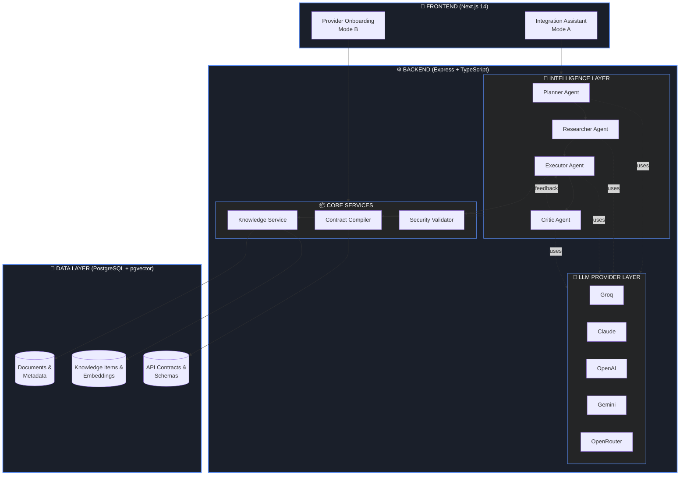
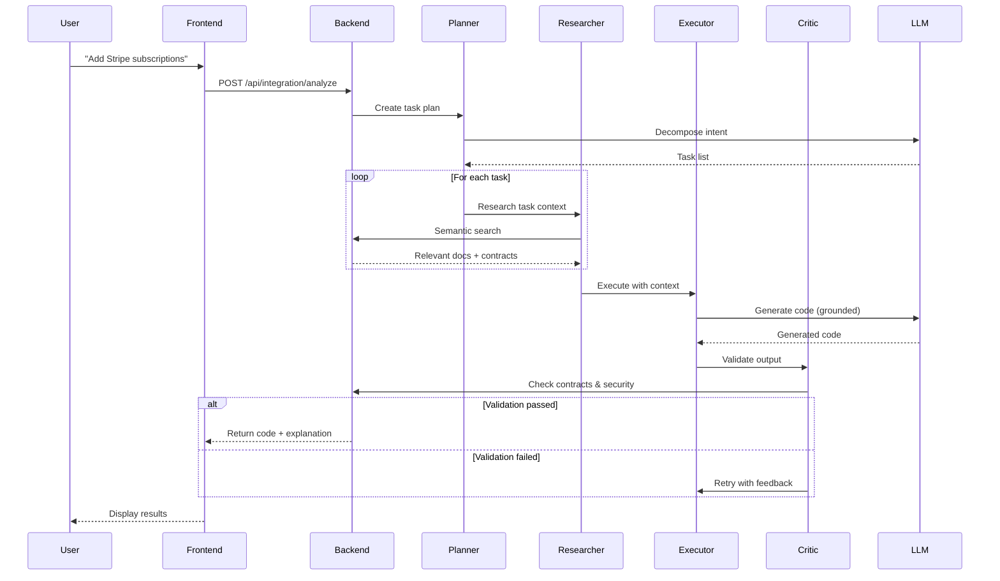

# 🏗️ Architecture Overview

Jobel is built as an enterprise-grade platform designed for reliability, security, and extensibility.

---

## High-Level Architecture



---

## Core Components

### 🎨 Frontend (Next.js 14)

Modern React application with two primary modes:

| Mode | Purpose |
|------|---------|
| **Integration Assistant (A)** | Natural language → Production code |
| **Provider Onboarding (B)** | Upload docs → Certified provider |

**Features:**
- Server-side rendering for fast initial load
- Real-time streaming responses
- Dark mode with premium aesthetics
- Mobile-responsive design

---

### ⚙️ Backend (Express + TypeScript)

Modular, service-oriented architecture:

```backend/src/
├── config/         # Environment & configuration
├── llm/            # Multi-provider LLM abstraction
├── providers/      # Pre-certified integrations (Auth0, Stripe)
├── routes/         # REST API endpoints
├── security/       # Security patterns & validation
├── services/       # Business logic & orchestration
└── types/          # TypeScript definitions
```

---

### 🧠 Intelligence Layer

The brain of Jobel. See [Multi-Agent Architecture](/docs/architecture/multi-agent) for details.

**Key services:**
- `AgentOrchestratorService` — Coordinates the agent loop
- `AgentPlannerService` — Task decomposition
- `AgentResearcherService` — Documentation retrieval
- `CodeValidatorService` — Security & accuracy validation
- `CodeFixerService` — Automated issue remediation

---

### 📋 Contract Compiler

The secret to zero hallucinations. See [Contract Compiler](/docs/architecture/contract-compiler) for details.

**Capabilities:**
- Parses OpenAPI, Markdown, JSON, and code examples
- Extracts verified API contracts with method signatures
- Stores in structured registry for LLM grounding
- Confidence scoring for extracted contracts

---

### 📚 Knowledge Service

RAG (Retrieval-Augmented Generation) pipeline:

1. **Ingestion** — Upload documents via API
2. **Parsing** — Smart chunking by section/endpoint
3. **Embedding** — Vector generation (Gemini/Jina/local)
4. **Indexing** — pgvector for semantic search
5. **Retrieval** — Context-aware document lookup

---

### 🔒 Security Layer

Enterprise security enforced at every layer:

- **Request validation** — Input sanitization
- **Security patterns** — 50+ rules for generated code
- **Provider-specific rules** — Auth0, Stripe security requirements
- **Output validation** — No secrets logged, HTTPS enforced

---

### 🔌 LLM Provider Layer

Unified interface to multiple LLM providers:

| Provider | Models | Notes |
|----------|--------|-------|
| **Groq** | Llama 3.3 70B | Default, free tier |
| **Claude** | Claude Sonnet 4 | Best reasoning |
| **OpenAI** | GPT-4o | Most popular |
| **Gemini** | Gemini 1.5 Pro | Free tier available |
| **OpenRouter** | 100+ models | Maximum flexibility |

Switch providers with a single environment variable.

---

## Data Flow

### Integration Request Flow



---

## Deployment Options

### Option 1: Docker Compose (Recommended)

```yaml
services:
  postgres:
    # pgvector for embeddings
  backend: 
    # Express API server
  frontend:
    # Next.js application
```

Single command deployment:
```bash
docker-compose up --build
```

### Option 2: Local Development

Separate processes for frontend and backend with hot reloading.

### Option 3: Cloud Deployment

Deploy to any container platform:
- AWS ECS / Fargate
- Google Cloud Run
- Azure Container Apps
- Kubernetes

---

## Scalability Considerations

| Component | Scaling Strategy |
|-----------|------------------|
| Frontend | Horizontal (stateless) |
| Backend | Horizontal with shared state |
| PostgreSQL | Vertical or managed service |
| LLM Providers | Rate limit aware, provider rotation |

---

## Next Steps

<div className="doc-cards">

- [**Multi-Agent Architecture**](/docs/architecture/multi-agent) — Deep dive into the agent loop
- [**Contract Compiler**](/docs/architecture/contract-compiler) — How zero-hallucination works
- [**Security Patterns**](/docs/features/security) — Enterprise security enforcement

</div>