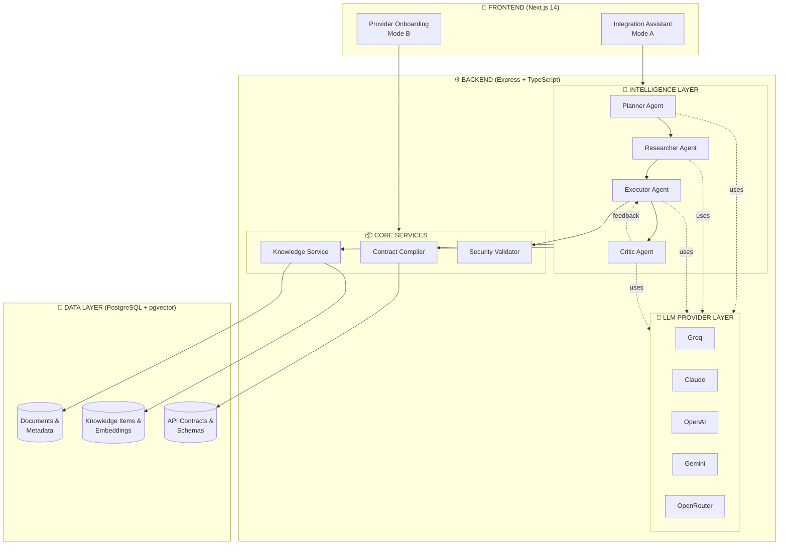

# 🏗️ Architecture Overview

## Why This Architecture Matters

Every AI coding tool promises to "write code for you." But here's what they don't tell you: **single-prompt AI is fundamentally unreliable for production systems**.

Jobel isn't built like ChatGPT or GitHub Copilot. It's built like **Manus** — engineered for professionals who ship to production, not hobbyists experimenting with demos.

**The difference? Architecture.**

Generic AI tools generate code in one shot based on training data. Jobel uses a **multi-agent orchestration loop** with verified contracts and self-healing validation. The result: code you can actually deploy.

---

## High-Level Architecture

---

## The Three Pillars

### 1. 🧠 Multi-Agent Intelligence

**The Problem:** Single-prompt AI lacks reasoning depth. It guesses, invents APIs, and produces code that "looks right" but breaks in production.

**Jobel's Solution:** Four specialized agents working in sequence:

| Agent | Role | Why It Matters |
|-------|------|----------------|
| **Planner** | Task decomposition | Breaks complex work into atomic steps—no vague one-shot prompts |
| **Researcher** | Knowledge retrieval | Finds **your** documentation, not Stack Overflow guesses |
| **Executor** | Code generation | Generates using verified contracts, not training data hopes |
| **Critic** | Validation & fixing | Self-heals issues before you see them—zero manual debugging |

This is **Manus-grade orchestration**. Every agent has one job and does it with precision. No hallucinations, no surprises.

[Learn more →](/docs/architecture/multi-agent)

---

### 2. 📋 Contract Authority

**The Problem:** Traditional AI "dreams up" plausible-sounding APIs like `stripe.customer.create_subscription()`. The method doesn't exist. You waste 30 minutes debugging an API that was never real.

**Jobel's Solution:** The Contract Compiler extracts **verified API contracts** from your documentation and builds a registry. The LLM can **only** reference methods that exist in this registry.

**Result:** Zero hallucinations. If the AI suggests a method, it's because it exists in *your* documentation.

This is what separates AI slop from production-ready tooling.

[Learn more →](/docs/architecture/contract-compiler)

---

### 3. 🔒 Security-First Validation

**The Problem:** AI-generated code often includes:
- Hardcoded secrets
- Missing webhook signature verification
- Insecure logging of sensitive data
- No HTTPS enforcement

**Jobel's Solution:** 50+ security patterns enforced **automatically**:

- ✅ Secrets in environment variables, never hardcoded
- ✅ Webhook signatures verified before processing
- ✅ Sensitive data excluded from logs
- ✅ HTTPS-only for external URLs
- ✅ Idempotency keys for financial operations

Your team doesn't need to remember these rules. Jobel enforces them at code generation time.

[Learn more →](/docs/features/security)

---

## How It Compares

### Generic AI Tools (ChatGPT, Copilot, Cursor)
- Single-prompt generation
- Training data = guesswork
- No validation loop
- Security as an afterthought
- "Close enough" code quality

### Jobel (Manus-Grade)
- Multi-agent orchestration
- Verified contract grounding
- Self-healing validation
- Security enforced at generation
- Production-ready output

**The question isn't "can AI write code?" It's "can you ship it?"**

---

## Built for Professionals

Jobel is designed for engineers building **real products** with **real stakes**:

- **Startups shipping MVPs** — Get Auth0 + Stripe integration right the first time
- **Enterprise teams** — Onboard internal APIs with consistent, validated patterns
- **Solo developers** — Stop debugging hallucinated methods at 2 AM

We built Jobel because we were tired of AI tools that felt like toys. This is Manus-grade infrastructure for professionals who ship.

---

## Technical Foundation

### Frontend
- Next.js 14 with server-side rendering
- Real-time streaming responses
- Two modes: Integration Assistant + Provider Onboarding

### Backend
- Express + TypeScript microservices
- Service-oriented architecture for extensibility
- Multi-LLM provider support (Groq, Claude, OpenAI, Gemini, OpenRouter)

### Data Layer
- PostgreSQL with pgvector for semantic search
- RAG pipeline for documentation retrieval
- Contract registry for zero-hallucination grounding

### Deployment
- Docker Compose for one-command deployment
- Self-hosted or cloud (AWS, GCP, Azure, Kubernetes)
- Horizontal scaling for frontend and backend

---

## Next Steps

- [**Multi-Agent Architecture**](/docs/architecture/multi-agent) — How the orchestration loop works
- [**Contract Compiler**](/docs/architecture/contract-compiler) — Zero-hallucination explained
- [**Security Patterns**](/docs/features/security) — Built-in security enforcement

