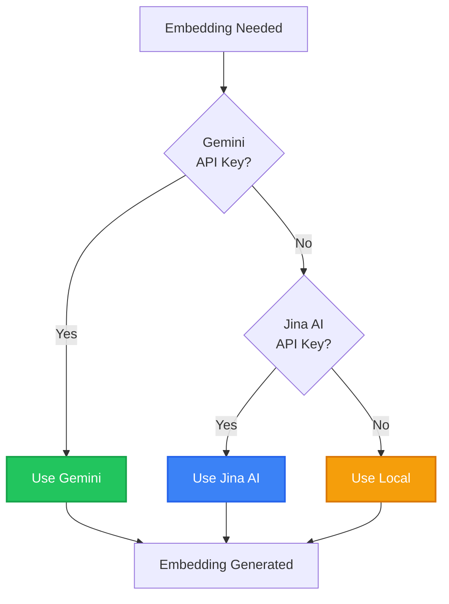

# 📚 Knowledge Base

Jobel's Knowledge Base is a **RAG (Retrieval-Augmented Generation)** system that ingests, processes, and indexes your documentation for context-aware code generation.

---

## How It Works


---

## Document Ingestion

### Supported Formats

| Format | Extension | Best For |
|--------|-----------|----------|
| **OpenAPI** | `.yaml`, `.json` | API specifications |
| **Markdown** | `.md` | Conceptual docs, guides |
| **JSON** | `.json` | API responses, configs |
| **Code** | `.py`, `.js`, `.ts` | Example implementations |
| **Text** | `.txt` | Any text content |

### Upload via API

```bash
curl -X POST http://localhost:4000/api/knowledge/upload \
  -H "X-Org-ID: org_123" \
  -F "file=@stripe-api.yaml" \
  -F "type=openapi"
```

### Response

```json
{
  "success": true,
  "document": {
    "id": "doc_abc123",
    "filename": "stripe-api.yaml",
    "type": "openapi",
    "status": "processing",
    "chunks": 47
  }
}
```

---

## Smart Chunking

Jobel intelligently splits documents based on content type:

### OpenAPI Chunking
Each endpoint becomes a chunk with full context:
```markdown
## POST /v1/subscriptions - Create Subscription
Creates a new subscription for a customer.

**Parameters:**
- customer (string, required): Customer ID
- items (array, required): Subscription items
- payment_behavior (string): How to handle payment

**Response:** Subscription object
**Tags:** subscriptions, billing
```

### Markdown Chunking
Split by headers while maintaining hierarchy:
```markdown
# Authentication        ← Section marker
## OAuth 2.0           ← Chunk boundary
Content about OAuth...

## API Keys            ← Chunk boundary
Content about keys...
```

### Code Chunking
Functions and classes become individual chunks:
```typescript
// Chunk: stripe.customers.create
async function createCustomer(email: string) {
  return stripe.customers.create({ email });
}
```

---

## Embedding Generation

Each chunk is converted to a vector embedding for similarity search.

### Embedding Providers

| Provider | Dimensions | Notes |
|----------|------------|-------|
| **Gemini** | 768 | Free tier, excellent quality |
| **Jina AI** | 768 | Free tier available |
| **Local** | 384 | No API key needed (fallback) |

### Configuration

```bash
# .env
EMBEDDING_PROVIDER=gemini    # gemini | jina | local
GEMINI_API_KEY=your_key
JINA_API_KEY=your_key        # Optional
```

### Provider Priority



---

## Semantic Search

Query the knowledge base using natural language:

### API

```bash
GET /api/knowledge/search?q=stripe+subscription+create&limit=5
# Headers
X-Org-ID: org_123
```

### Response

```json
{
  "results": [
    {
      "id": "chunk_123",
      "content": "Create a subscription using stripe.subscriptions.create()...",
      "score": 0.92,
      "source": "stripe-api.yaml",
      "section": "Subscriptions > Create",
      "tags": ["subscriptions", "billing"],
      "highlights": ["subscription", "create"]
    }
  ],
  "total": 5,
  "searchTime": 45
}
```

### How Similarity Works

```
Query: "How do I create a Stripe subscription?"
         ↓
   Embed Query (vector)
         ↓
   Cosine Similarity with all chunks
         ↓
   Return top-k matches above threshold
```

---

## Knowledge Item Structure

```typescript
interface KnowledgeItem {
  id: string;
  orgId: string;
  documentId: string;
  
  // Content
  content: string;           // Chunk text
  title?: string;            // Section title
  section?: string;          // Parent section
  
  // Metadata
  tags: string[];
  embedding: number[];       // Vector (stored in pgvector)
  
  // Timestamps
  createdAt: Date;
  updatedAt: Date;
}
```

---

## Document Management

### List Documents

```bash
GET /api/knowledge/documents

# Response
{
  "documents": [
    {
      "id": "doc_123",
      "filename": "stripe-api.yaml",
      "type": "openapi",
      "status": "indexed",
      "chunkCount": 47,
      "uploadedAt": "2024-01-15T10:30:00Z"
    }
  ]
}
```

### View Document Chunks

```bash
GET /api/knowledge/documents/doc_123/chunks

# Response
{
  "chunks": [
    {
      "id": "chunk_1",
      "title": "Create Customer",
      "content": "POST /v1/customers...",
      "tags": ["customers"]
    }
  ]
}
```

### Delete Document

```bash
DELETE /api/knowledge/documents/doc_123
# Removes document and all associated chunks
```

---

## Knowledge Stats

```bash
GET /api/knowledge/stats

# Response
{
  "totalDocuments": 12,
  "processingDocuments": 0,
  "totalChunks": 347,
  "totalSize": 2457600,  // bytes
  "embeddingProvider": "gemini"
}
```

---

## Best Practices

### 1. Use OpenAPI When Possible
OpenAPI specs provide the most reliable extraction with exact method signatures.

### 2. Organize Markdown with Clear Headers
```markdown
# API Reference           ← Top level
## Authentication         ← Section
### Bearer Tokens         ← Subsection
```

### 3. Include Code Examples
Code examples help Jobel understand usage patterns:
```markdown
## Create Subscription
```typescript
const sub = await stripe.subscriptions.create({
  customer: 'cus_123',
  items: [{ price: 'price_456' }]
});
```
```

### 4. Tag Your Content
Use consistent terminology that matches user queries.

### 5. Keep Chunks Focused
Split large documents into focused sections for better retrieval.

---

## Integration with Code Generation

When a user makes a request:
1. **Query Expansion** — Planner generates search queries
2. **Retrieval** — Researcher fetches relevant chunks
3. **Context Building** — Chunks assembled for Executor
4. **Generation** — LLM uses context for grounded output

```typescript
// Internal flow
const searchQueries = planner.generateQueries(userRequest);
const chunks = await Promise.all(
  searchQueries.map(q => knowledgeService.search(orgId, q))
);
const context = buildContext(chunks.flat());
const code = await executor.generate(userRequest, context);
```

---

## Next Steps

<div className="doc-cards">

- [**Contract Compiler**](/docs/architecture/contract-compiler) — API contract extraction
- [**Providers**](/docs/features/providers) — Pre-certified integrations
- [**API Reference**](/docs/api/overview) — Full API documentation

</div>