# 📚 Knowledge Base

## The Training Data Problem

ChatGPT is trained on public data from 2021. Copilot learns from GitHub repos. Cursor uses generic web scrapes.

**Result:** They know common patterns, but they **don't know your APIs**.

- Your internal billing system? Not in the training data.
- Your company's authentication flow? Never seen it.
- Your API's latest v3 release? Trained on v1 documentation from 2020.

So they guess. Sometimes they're close. Often they're wrong. **Always they're unreliable.**

---

## The RAG Solution

Jobel uses **RAG (Retrieval-Augmented Generation)**: Upload your documentation, and the AI generates code based on **your current APIs**, not outdated training data.

```mermaid
flowchart LR
    Upload[📁 Documents<br/>Upload] --> Parser[📝 Parser<br/>Chunking]
    Parser --> Embedder[🧠 Embedder<br/>Vectorize]
    Embedder --> PGVector[(💾 pgvector<br/>Index)]
    PGVector --> Search[🔍 Semantic Search<br/>Query → Similar Chunks → LLM]
```

**How it works:**
1. **Upload** — You provide API docs (OpenAPI, Markdown, code examples)
2. **Parse** — Smart chunking by section, endpoint, or function
3. **Embed** — Vector generation for semantic search
4. **Index** — Store in pgvector for fast retrieval
5. **Retrieve** — When generating code, find relevant documentation chunks

**Result:** The AI knows **your** APIs with the same reliability as public ones.

---

## Why This Matters

### For Public APIs
**Generic AI:** "I think Stripe has a method called `customer.create_subscription`..."  
**Jobel:** "The Stripe documentation shows `subscriptions.create()` requires `customer` and `items` parameters."

### For Internal APIs
**Generic AI:** "I don't have information about your internal billing API."  
**Jobel:** "Your billing API documentation shows `/api/v3/invoices/create` requires `customer_id`, `line_items`, and `due_date`."

**The difference: Accuracy from documentation, not guesses from training data.**

---

## Supported Documentation Formats

Jobel parses any format you have:

| Format | Extension | Best For |
|--------|-----------|----------|
| **OpenAPI** | `.yaml`, `.json` | API specifications |
| **Markdown** | `.md` | Conceptual docs, guides |
| **JSON** | `.json` | API responses, configs |
| **Code** | `.py`, `.js`, `.ts` | Example implementations |
| **Text** | `.txt` | Any text content |

**Upload once. Use forever.**

---

## Smart Chunking

Jobel doesn't just dump your documentation into a database. It chunks intelligently:

### OpenAPI → Endpoint-Level Chunks
Each API endpoint becomes a searchable chunk with full context:
- Method + path (e.g., `POST /v1/subscriptions`)
- Parameters (required vs optional, types, validation)
- Response schema
- Authentication requirements

### Markdown → Section-Level Chunks
Documentation is split by headers while maintaining hierarchy:
- Top-level sections stay connected to subsections
- Code examples are grouped with explanatory text
- Cross-references are preserved

### Code → Function-Level Chunks
Example code is parsed into individual functions/classes:
- Each function becomes a searchable chunk
- Context includes imports and surrounding documentation
- Usage patterns are extracted

**Result:** When you ask for subscription creation, Jobel finds the exact endpoint—not the entire 10,000-line API spec.

---

## Semantic Search Explained

Traditional search matches keywords. Semantic search understands **meaning**.

**Example:**  
User request: *"How do I charge a customer monthly?"*

**Keyword search would look for:**  
"charge", "customer", "monthly"

**Semantic search understands:**  
This is about **subscription creation with recurring billing**

**So it finds:**
- Stripe `subscriptions.create()` endpoint
- Recurring pricing documentation  
- Webhook handling for subscription events

**This is why Jobel generates accurate code—it understands context, not just keywords.**

---

## Embedding Providers

Jobel uses vector embeddings to enable semantic search. You can choose your provider:

| Provider | Dimensions | Notes |
|----------|------------|-------|
| **Gemini** | 768 | Free tier, excellent quality (default) |
| **Jina AI** | 768 | Free tier available |
| **Local** | 384 | No API key needed (fallback) |

**Jobel automatically falls back** if your preferred provider is unavailable.

---

## How It Integrates with Code Generation

When you make a request, here's what happens behind the scenes:

1. **Planner** — Decomposes your request into research queries
2. **Researcher** — Searches the knowledge base for relevant documentation
3. **Contract Compiler** — Looks up verified API contracts
4. **Executor** — Generates code using retrieved context + verified contracts

**Example flow:**  
Request: *"Add Stripe subscription billing"*

- Researcher finds: Stripe subscription docs, webhook handling guide, pricing documentation
- Contract Compiler finds: `stripe.subscriptions.create()` contract with parameters
- Executor generates: Complete subscription system with webhook verification

**Your documentation becomes the AI's ground truth.**

---

## Jobel vs Generic AI

| Issue | ChatGPT / Copilot | Jobel |
|-------|-------------------|-------|
| **Internal APIs** | ❌ No knowledge | ✅ Upload docs, instant support |
| **API versions** | ⚠️ Trained on old data | ✅ Your current docs |
| **Outdated patterns** | ⚠️ Suggests deprecated methods | ✅ Always uses latest |
| **Context accuracy** | ⚠️ Guesses from training | ✅ Retrieves from your docs |
| **Documentation updates** | ❌ Can't update training | ✅ Re-upload, instant update |

**The knowledge base is what makes Jobel reliable for real-world work.**

---

## Built for Teams

### Startups
Upload Auth0, Stripe, and your internal APIs. Generate consistent code across your stack.

### Enterprise
Onboard proprietary systems with the same reliability as public APIs. No vendor lock-in—self-host and keep documentation private.

### Solo Developers
Stop Googling API documentation. Upload once, generate forever.

---

## The Manus-Grade Advantage

Generic AI tools rely on stale training data and call it "good enough."

Jobel uses **your documentation** as the source of truth. The knowledge base ensures the AI knows your APIs—current, accurate, complete.

This is what separates AI slop from Manus-grade tooling: **Reliability through real-time retrieval, not outdated guesses.**

---

## Next Steps

- [**Contract Compiler**](/docs/architecture/contract-compiler) — How contracts + knowledge = zero hallucinations
- [**Multi-Agent Architecture**](/docs/architecture/multi-agent) — How agents use the knowledge base
- [**API Reference**](/docs/api/overview) — Upload and search endpoints

